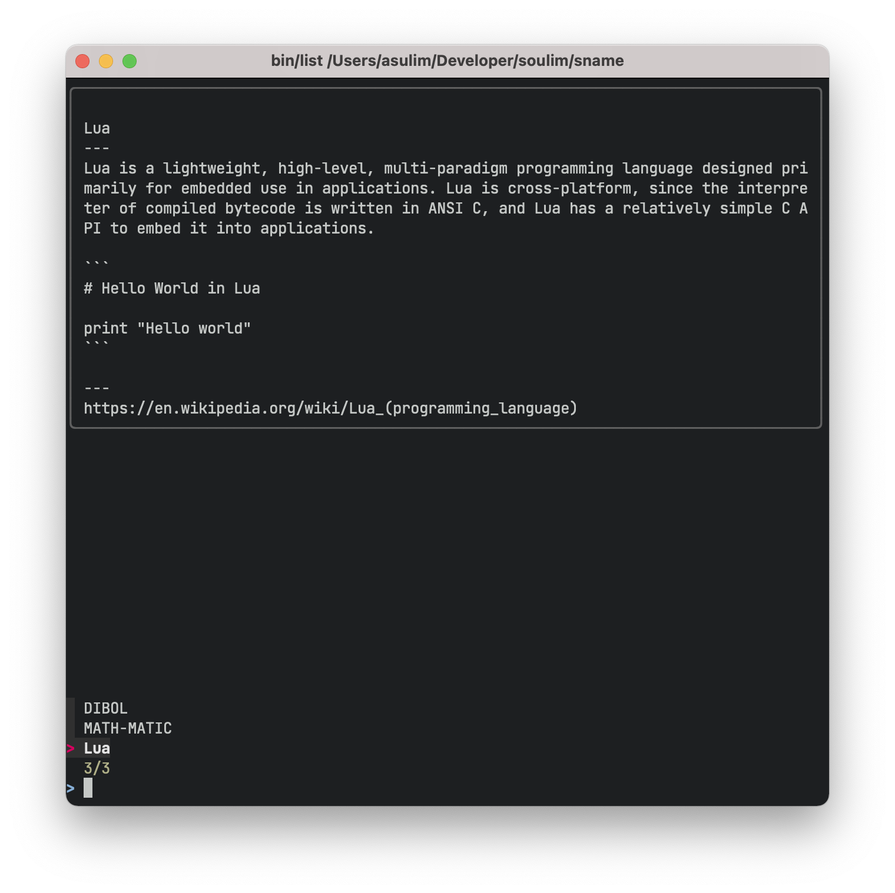

# Sprint name tool (sname)



Sprint name tool helps to choose an interesting name for a sprint.
At the moment it uses a database of 655 programming languages as
a source of inspiration.

**WARNING:** it's a prototype project. Everything is unstable.

## Install

```shell
git clone git@github.com:soulim/sname.git
cd sname
```

## Usage

```shell
# list all names
bin/list

# if you have FZF installed

# select one with fuzzy search and preview
bin/list | fzf --preview="bin/preview {}" --preview-window=up:wrap

# select one from three random options
bin/list | shuf | head -n 3 | fzf --preview="bin/preview {}" --preview-window=up:wrap

# select one from three random options and remember the choice
bin/list | shuf | head -n 3 | fzf --preview="bin/preview {}" --preview-window=up:wrap --no-multi | bin/pin
```

## Data sources

The database of programming languages is built using following sources:

  * [Wikipedia](https://www.wikipedia.org/)
  * [The Hello World Collection](http://helloworldcollection.de/)

## Contributing

Please see [CONTRIBUTING](docs/CONTRIBUTING.md) for details.

## License

Copyright (c) Alexander Sulim

Sprint name tool (sname) is an Open Source project licensed under the terms of
the LGPLv3 license.  Please see [COPYING.LESSER](COPYING.LESSER) for license text.
